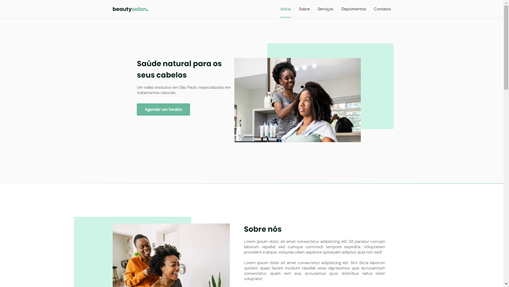
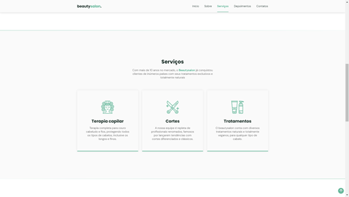
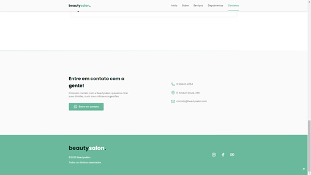
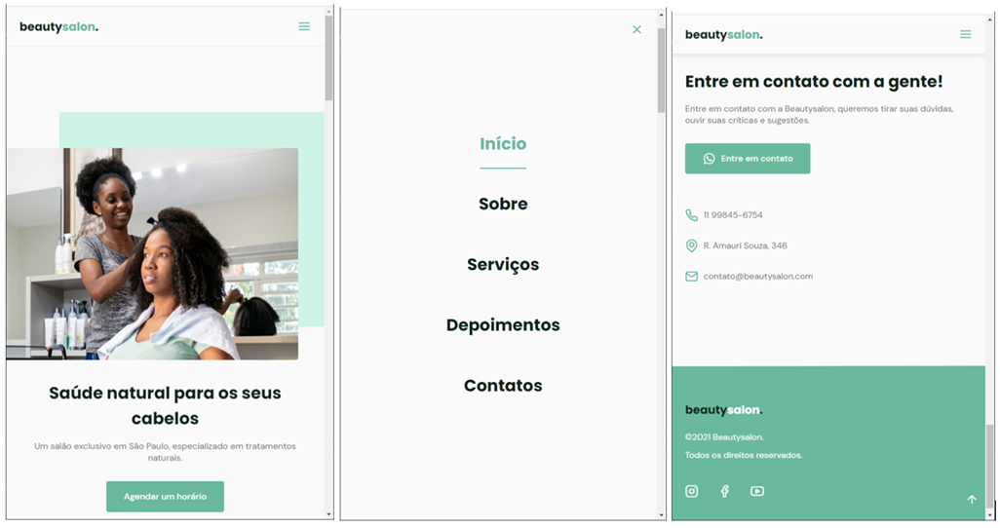

# Projeto OriginSix (RocketSeat)

Projeto oferecido gratuitamente pela rocketseat através da trilha `<nlw>6` - [Mission: Origin](https://app.rocketseat.com.br/node/mission-origin).

## Tecnologias utilizadas

- HTML
- CSS
  - Responsividade (web e mobile)
- Javascript
  - Carrossel
  - ScroolReveal

### Instrutor:

- [Mayk Brito](https://github.com/maykbrito)

## Imagens do projeto

- Versão Web

  

- Versão Mobile

Link do projeto publicado: [OriginSix](https://arnongp.github.io/originSix/#home)
